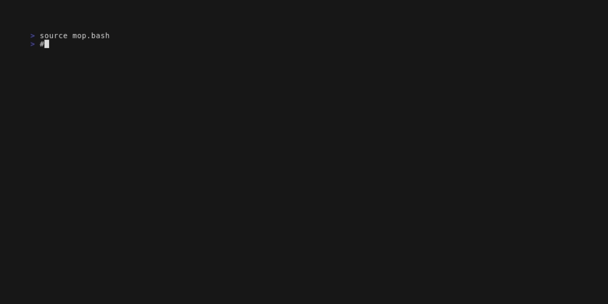

# mop

mop is an open-source tool designed to support manual operations using GitHub Issues.

## Features

- Define and organize manual operations using GitHub Issues
- Execute the operations fetched from the Issue and complete the commands
- Upload the execution results as a comment to the Issue
- Search and complete predefined utility commands 



## Requirements

Before using mop, ensure the following tools are installed:

- gh (GitHub CLI)
- jq (Command-line JSON processor)
- script (Linux command for recording terminal sessions)

Please note that mop is currently tested only on Linux. 
Furthermore, mop may not be compatible with tools that change the console prompt, such as Starship.

## Installation

mop can be installed as a GitHub CLI extension.

```console
gh extension install zoetrope/gh-mop
```

Copy `mop.bash` to a directory of your choice and add the following line to your `.bashrc`:

```bash
source ~/mop.bash
```

## Configuration

Create a configuration file as shown below and save it as $HOME/.mop.json.

```json
{
  "owner": "zoetrope",
  "repository": "gh-mop",
  "utilities": 4,
  "datadir": "/tmp/mop"
}
```

| Field      | Description                                                              |
|------------|--------------------------------------------------------------------------|
| owner      | The owner name of the GitHub repository where you define your operations |
| repository | The name of the GitHub repository where you define your operations       |
| utilities  | The Issue number containing utility commands                             |
| datadir    | The location for temporary files generated by mop                        |

## Getting Started

1. Login to GitHub: Run `gh auth login` command to login to GitHub.
2. Create an Issue: Define the operations in a new GitHub Issue for your repository (e.g. #1).
Here is an example of the content format. Write the manual operations you want to execute within the code block:

````markdown
## This issue is a sample to define a manual operation

```
# This is a comment
$ kubectl get pod

# You can omit $
kubectl get deployment

# This is a multiline command
$ kubectl get svc -n default \
    -o yaml \
    --show-managed-fields
```
````

3. Start the Operation: In bash, run `mop-start` command with the number of the Issue you created:

```markdown
$ mop-start 1
```

The prompt will change to the format `[repository_name#issue_number:Step_number]$`:

```markdown
[gh-mop#1:Step0]$ 
```

4. Execute Commands: Press `Ctrl+t` shortcut to complete the first command to be executed:

```markdown
[gh-mop#1:Step0]$ kubectl get pod
```

5. Execute the command, run `next` command, and press `Ctrl+t` again. The next command will be completed:

```markdown
[gh-mop#1:Step0]$ next
[gh-mop#1:Step1]$ kubectl get deployment
```

Repeat this process until the operation is complete.

6. Upload Results: When the operation is complete, execute `upload` command:

```markdown
[gh-mop#1:Step2]$ upload
```

The execution results will be uploaded as a comment to the Issue where the operation was defined.

## Advanced Usage

### Referencing Operations

When writing operations in an Issue, you can reference other Issues containing operations. 
This is especially useful when you need to repeat the same operation.
To reference another Issue, simply use the following syntax:

```markdown
ref #5
```

### Utility Command Search

mop provides a convenient feature to search and complete predefined utility commands, which allows you to quickly access and execute frequently-used commands during manual operations.
To use this feature, follow these steps:

1. Create a Utility Issue: In your GitHub repository, create an Issue dedicated to utility commands (e.g. #5). Define the utility commands in this Issue using the same format as regular operations.
2. Update Configuration: Open your `.mop.json` configuration file and set the `utilities` field to the number of the Utility Issue you created. This will let mop know where to find the utility commands.
3. Search and Complete: While working on a manual operation, press the `Ctrl+o` shortcut to initiate a search for the predefined utility commands. Upon selecting a command from the list, it will be automatically completed in your current console, ready for execution.
